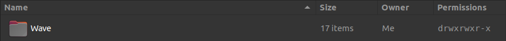
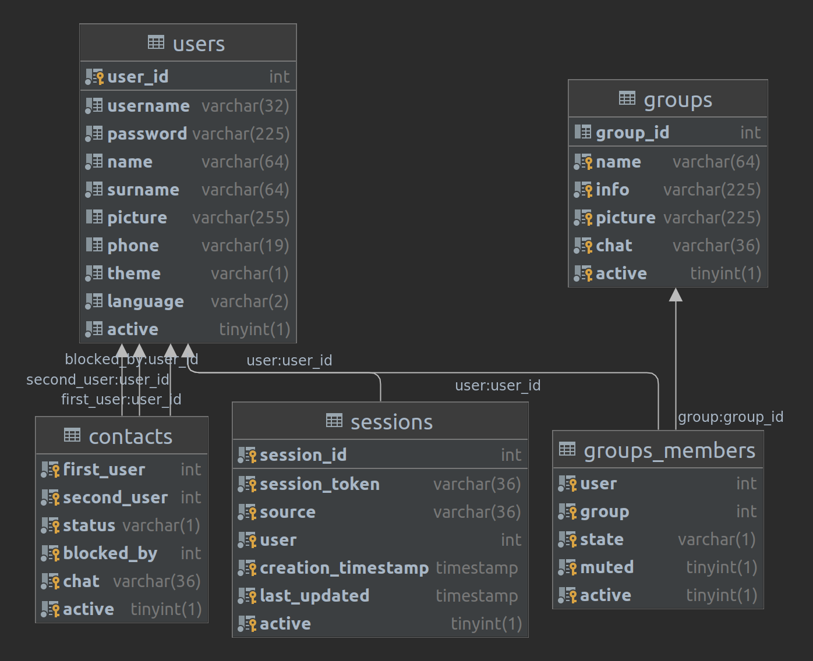

# Wave REST Server

## LAMP application

> ### Warning
> This is a utility guide to set up the project.  
> Some steps may be superficial (like the installations)  
> It's suggested to follow this tutorial:
>
> - [How To Install Linux, Apache, MySQL, PHP (LAMP) stack on Ubuntu 20.04](https://www.digitalocean.com/community/tutorials/how-to-install-linux-apache-mysql-php-lamp-stack-on-ubuntu-20-04)
> - [How To Install and Secure phpMyAdmin on Ubuntu 20.04](https://www.digitalocean.com/community/tutorials/how-to-install-linux-apache-mysql-php-lamp-stack-on-ubuntu-20-04)
> - [How To Create a New User and Grant Permissions in MySQL](https://www.digitalocean.com/community/tutorials/how-to-create-a-new-user-and-grant-permissions-in-mysql)
> - [How To Install and Use Composer on Ubuntu 20.04](https://www.digitalocean.com/community/tutorials/how-to-install-and-use-composer-on-ubuntu-20-04)
> - [Install PHP 8 on Ubuntu 20.04](https://medium.com/techiediaries-com/install-php-8-on-ubuntu-20-04-b53f76ef1d62)

### Environment

**L**inux Ubuntu 20.04.1 Kernel 5.13.0-39-generic

**A**pache 2.4.41-4ubuntu3.8

**M**ySQL 8.0.28-0ubuntu0.20.04.3

**P**HP 8.1.4

### Apache Server

Install the server from the bash using:

`sudo apt install apache2`

#### Server configurations

Enable the RewriteRules from the bash with:

`sudo a2enmod rewrite`

In the file /etc/apache2/apache2.conf add:

```
# This is the main Apache server configuration file. It contains the   
[...]

<Directory /absolute/path/to/your/project/directory>  
    RewriteEngine on   
    AllowOverride All   
    Require all granted  
</Directory>

[...]
```

The path mustn't contain trailing /  
The directory should be under the current user ownership:



In case it is not, type:

<code>sudo chown **you**:**yourGroup** **path/to/your/project/directory**</code>

#### Logging

In case you need to debug server errors it is suggested to add:

```
# LogLevel: Control the severity of messages logged to the error_log.   
[...]  
LogLevel alert rewrite:trace6
```

The log files can be found in:  
`/var/log/apache2/access.log`

The error log can be found in:  
`/var/log/apache2/error.log`

#### Project domain configuration

under `/etc/apache2/sites-available` add `wave.com.conf` (in general `your.domain.conf`)  
and write:

```apacheconf
<VirtualHost *:80>    
    ErrorLog ${APACHE_LOG_DIR}/error.log
    CustomLog ${APACHE_LOG_DIR}/access.log combined
    
    # Name
    ServerName www.wave.com
    ServerAlias wave.com
    
    # Home
    DocumentRoot /home/giacomo/Projects/LAMP/Wave/
    
    ProxyPreserveHost On
    # ProxyPass / http://127.0.0.1:3000/
    # ProxyPassReverse / http://127.0.0.1:3000/
</VirtualHost>
```

Use the bash to enable the domain:

`sudo a2ensite wave.com.conf`

And finally make it visible in your machine by adding the domain inside the file `/etc/hosts`:

```
# Wave server address
127.0.1.1	wave.com
127.0.1.1	www.wave.com
```

#### Test correct configuration

To check if it all went well type:

`sudo apache2ctl configtest`

You should expect `Syntax OK`

### MySQL database

Install the service with:

`sudo apt install mysql-server`

#### Database user

enter the CLI with:

`sudo mysql`

In this modality you're using the root, to add a user for future uses type:

```mysql
CREATE USER 'user'@'localhost' IDENTIFIED BY 'password';
```

and

```mysql
GRANT ALL PRIVILEGES ON *.* TO 'user'@'localhost';
```

In this project the database user is called "giacomo" with password "".  
It is written in `/src/Specification/Database/Database.php`

#### Database schema

First create the database using the mysql CLI:

```mysql
CREATE DATABASE wave
```

Then define the DDLs:

```mysql
CREATE TABLE sessions
(
  session_id         INTEGER     NOT NULL PRIMARY KEY AUTO_INCREMENT,
  session_token      VARCHAR(36) NOT NULL CHECK ( LENGTH(session_token) > 35 ) UNIQUE,
  source             VARCHAR(36) NOT NULL CHECK ( LENGTH(source) > 35 ) UNIQUE,
  user               INTEGER     NOT NULL,
  creation_timestamp TIMESTAMP   NOT NULL,
  last_updated       TIMESTAMP   NOT NULL,
  active             BOOLEAN     NOT NULL,
  FOREIGN KEY (user)
    REFERENCES users (user_id)
    ON DELETE CASCADE
)
```

```mysql
CREATE TABLE users
(
  user_id  INTEGER                 NOT NULL PRIMARY KEY AUTO_INCREMENT,
  username VARCHAR(32)             NOT NULL CHECK ( LENGTH(username) > 4 ) UNIQUE,
  password VARCHAR(255)            NOT NULL,
  name     VARCHAR(64)             NOT NULL,
  surname  VARCHAR(64)             NOT NULL,
  picture  VARCHAR(255),
  phone    VARCHAR(19) CHECK ( LENGTH(phone) > 4 ),
  theme    VARCHAR(1) DEFAULT 'L'  NOT NULL,
  language VARCHAR(2) DEFAULT 'EN' NOT NULL CHECK ( LENGTH(language) > 1 ),
  active   BOOLEAN                 NOT NULL
)
```

```mysql
CREATE TABLE contacts
(
  first_user  INTEGER    NOT NULL,
  second_user INTEGER    NOT NULL,
  status      VARCHAR(1) NOT NULL,
  blocked_by  INTEGER,
  chat        VARCHAR(36) CHECK ( LENGTH(chat) > 35 ) UNIQUE,
  active      BOOLEAN    NOT NULL,
  FOREIGN KEY (first_user)
    REFERENCES users (user_id)
    ON DELETE CASCADE,
  FOREIGN KEY (second_user)
    REFERENCES users (user_id)
    ON DELETE CASCADE,
  FOREIGN KEY (blocked_by)
    REFERENCES users (user_id)
    ON DELETE SET NULL
)
```

```mysql
CREATE TABLE `groups`
(
  group_id INTEGER      NOT NULL PRIMARY KEY AUTO_INCREMENT,
  name     VARCHAR(64)  NOT NULL,
  info     VARCHAR(225) NOT NULL,
  picture  VARCHAR(225) UNIQUE,
  chat     VARCHAR(36)  NOT NULL CHECK ( LENGTH(chat) > 35 ) UNIQUE,
  active   BOOLEAN      NOT NULL
)
```

```mysql
CREATE TABLE groups_members
(
  user    INTEGER    NOT NULL,
  `group` INTEGER    NOT NULL,
  state   VARCHAR(1) NOT NULL,
  muted   BOOLEAN    NOT NULL,
  active  BOOLEAN    NOT NULL,
  FOREIGN KEY (user)
    REFERENCES users (user_id)
    ON DELETE CASCADE,
  FOREIGN KEY (`group`)
    REFERENCES `groups` (group_id)
    ON DELETE CASCADE
)
```

The schema diagram should correspond to this:  


#### phpMyAdmin

If you prefer having a visual assistance tool, you can install phpMyAdmin
following [this tutorial](https://www.digitalocean.com/community/tutorials/how-to-install-linux-apache-mysql-php-lamp-stack-on-ubuntu-20-04)

Because the database user have no password you to allow phpMyAdmin to have this kind of user by go to the
file `/etc/phpMyAdmin/config.inc.php` and change line 98, as the comment suggest:

```injectablephp
$cfg['Servers'][$i]['AllowNoPassword'] = TRUE;
```

### PHP runtime

Install the dependency with:

`sudo apt install software-properties-common`  
`sudo add-apt-repository ppa:ondrej/php`  
`sudo apt update`  
`sudo apt install php8.1`

Since by default Apache use php 7.4, you need to change it, by typing:

`sudo a2dismod php7.4`  
`sudo a2enmod php8.1`

#### Composer

Finally, you need to add composer to the machine, by
following [this tutorial](https://www.digitalocean.com/community/tutorials/how-to-install-and-use-composer-on-ubuntu-20-04)

Type `composer install` in your project directory and the `vendor` directory, containing the project dependencies, will
appear

### Test

To test either the application run with PHPUnit the scripts under the `test` directory or use
the [insomnia tool](https://insomnia.rest/) and add the collection by clicking the "create" button and "import from
file".  
Choose either the yaml file or the json included in the project under `test/Insomnia/`
