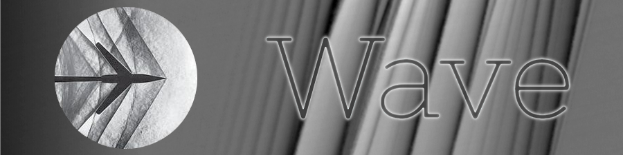

by Giacomo Guidotto

---

Wave is a full stack messaging application realize following the [REST API ideology](https://restfulapi.net/). This is
the backend: an [OPENAPI standardized](https://www.openapis.org/) LAMP server with a WebSocket channel that offer
real-time CRUD-based HTTP-like messages

# Documentation

Read this documents to get to know this application:

- [Utility guide: set up the project](documentation/set_up.md)
- [OPENAPI specification](openapi/wave.yaml), explorable with the [Swagger editor](https://editor.swagger.io/)